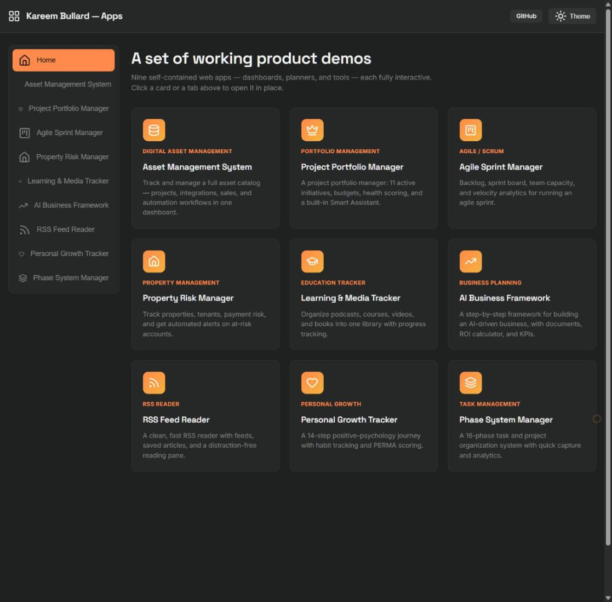
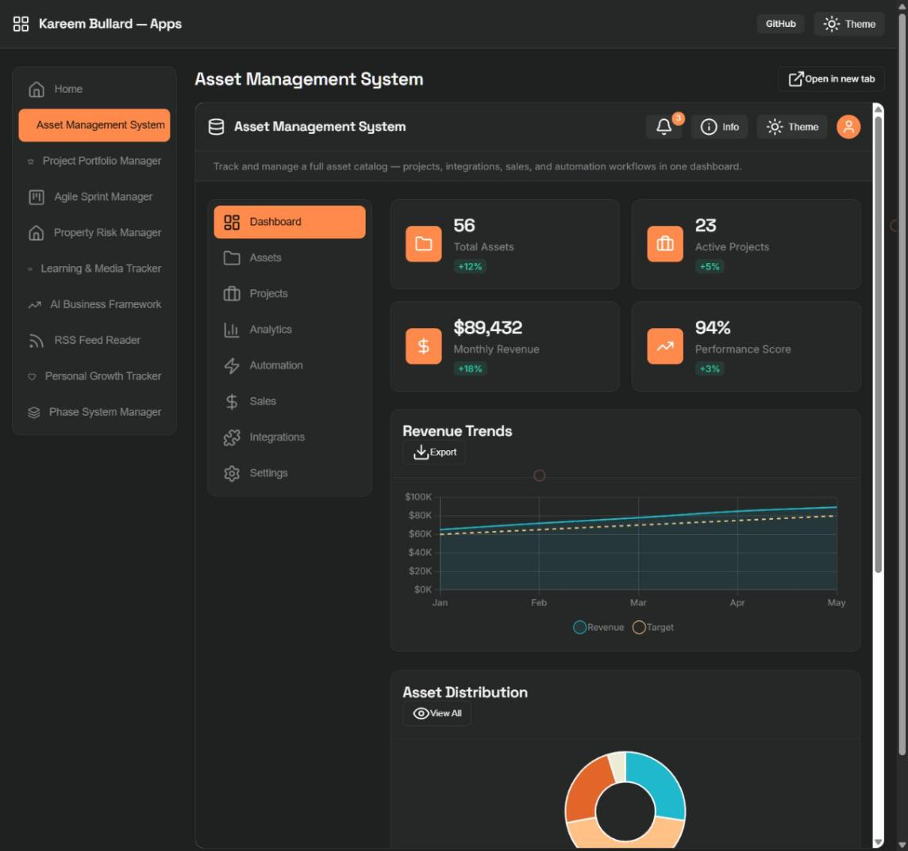
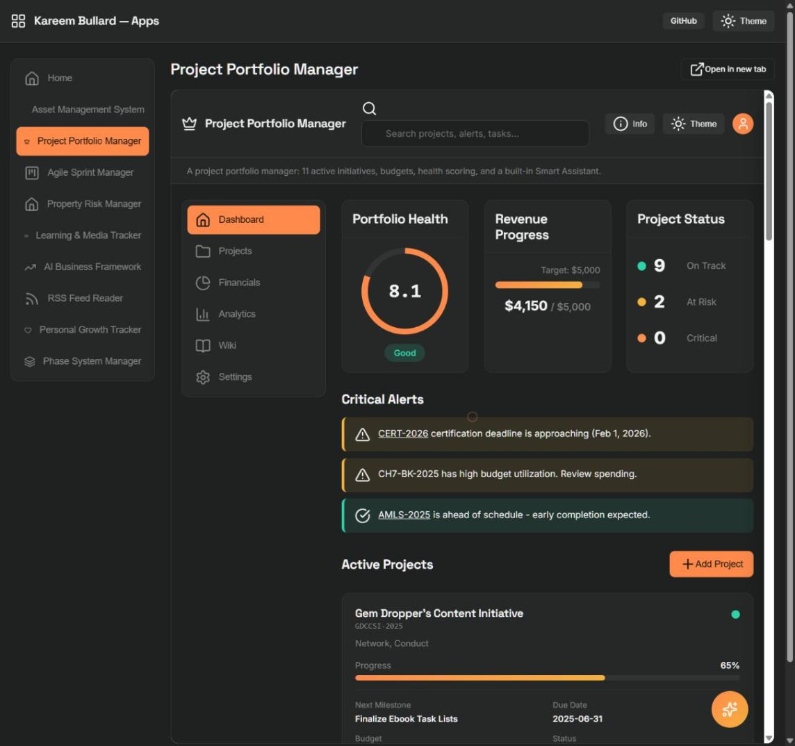
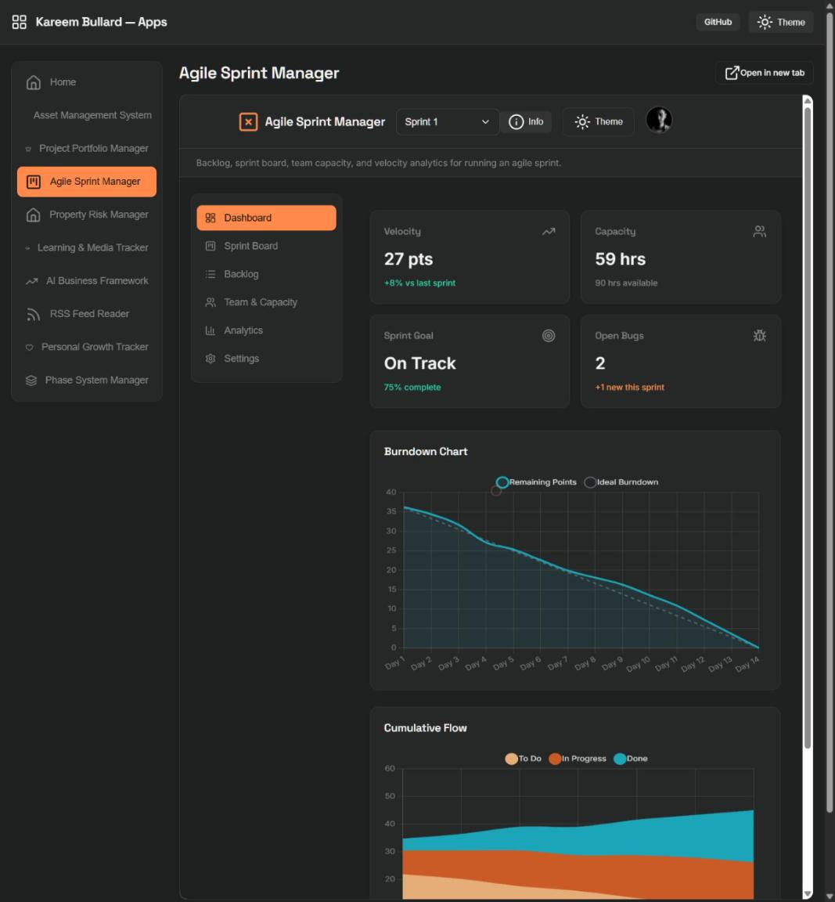
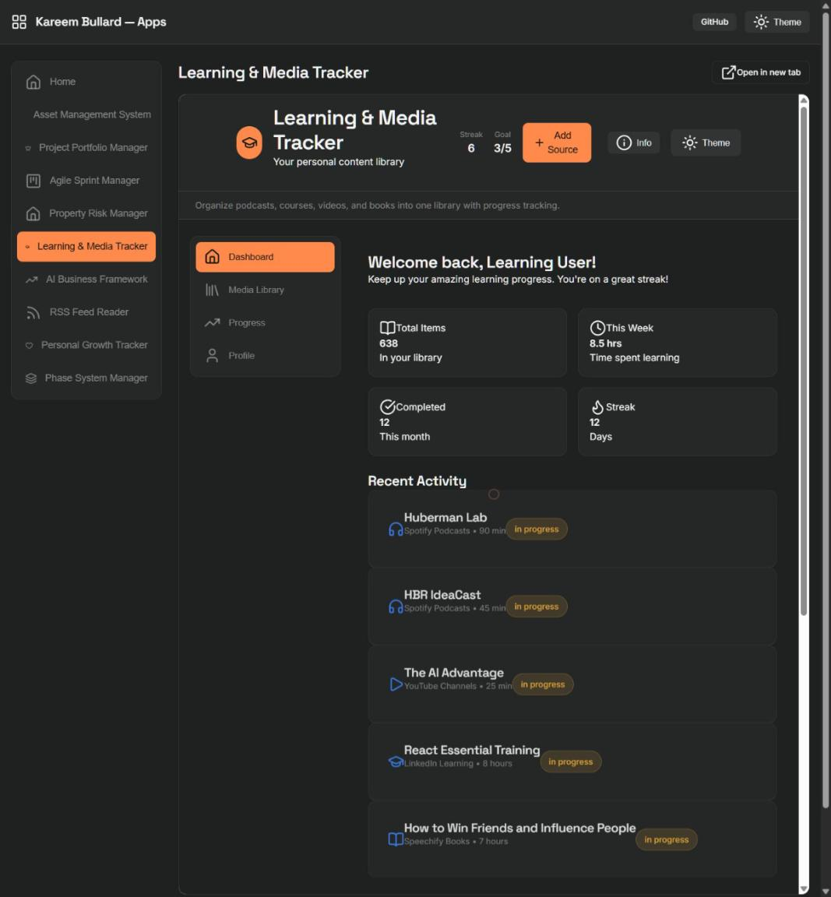
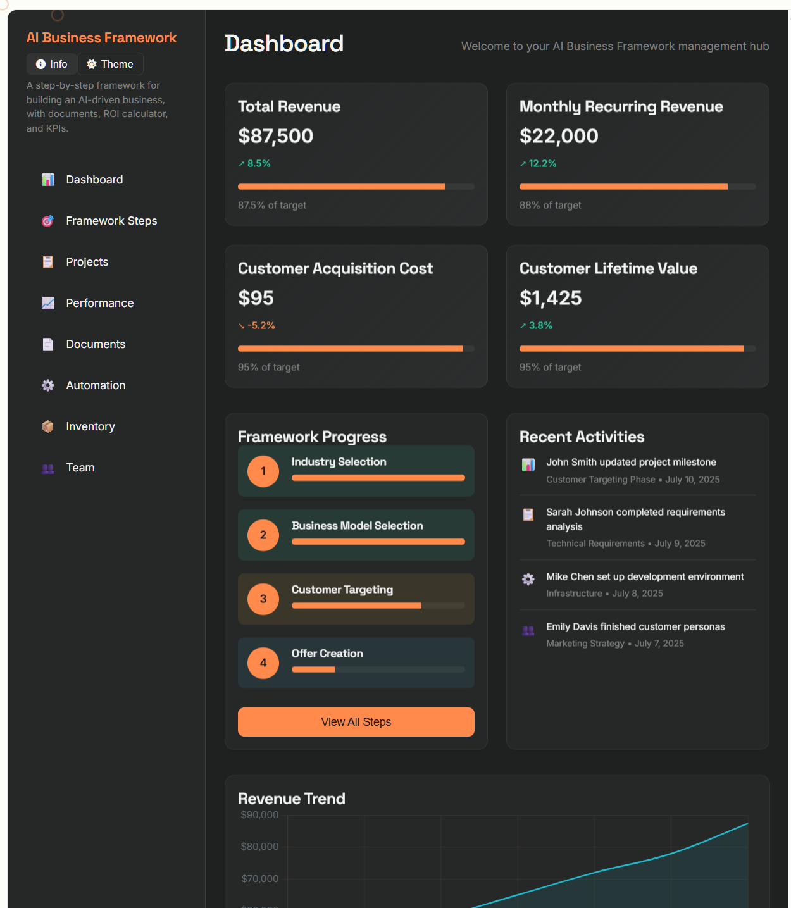
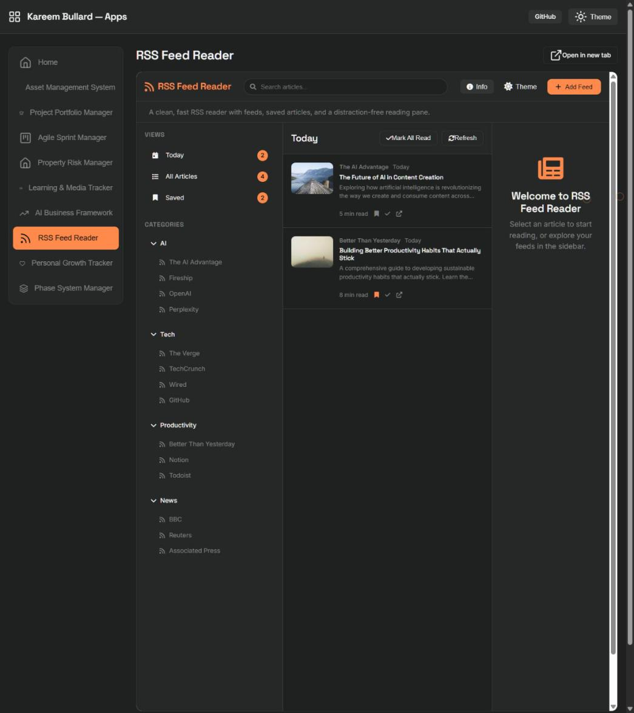
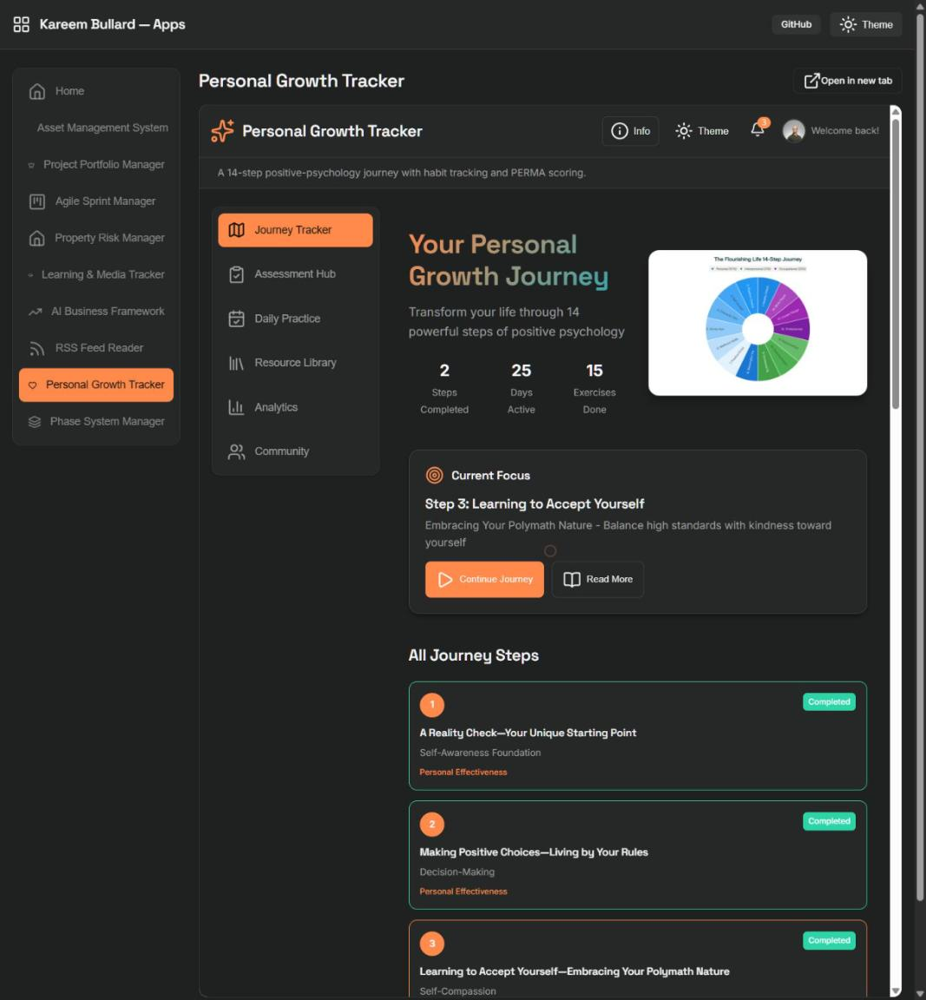
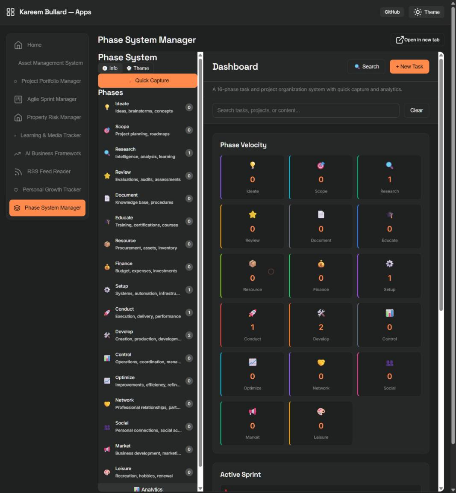

# Kareem Bullard — App Showcase

**Live demo: [apps.kareembullard.com](https://apps.kareembullard.com)**

A portfolio of nine self-contained, fully-interactive web apps — dashboards, planners, trackers, and tools. Every app is a single static HTML file: no build step, no framework, no backend. Click around, add/edit records, flip dark/light mode — it all works, and everything is persisted locally in your browser via `localStorage`. Nothing is ever sent to a server. See [Privacy & Terms](https://apps.kareembullard.com/privacy.html) for details.



## The apps

| App | Category | What it does |
|---|---|---|
| [Asset Management System](https://apps.kareembullard.com/#asset-hub) | Digital Asset Management | Track and manage a full asset catalog — projects, integrations, sales, and automation workflows in one dashboard. |
| [Project Portfolio Manager](https://apps.kareembullard.com/#portfolio-dashboard) | Portfolio Management | A project portfolio manager: 11 active initiatives, budgets, health scoring, and a built-in Smart Assistant. |
| [Agile Sprint Manager](https://apps.kareembullard.com/#sprint-planner) | Agile / Scrum | Backlog, sprint board, team capacity, and velocity analytics for running an agile sprint. |
| [Property Risk Manager](https://apps.kareembullard.com/#landlord-risk-manager) | Property Management | Track properties, tenants, payment risk, and get automated alerts on at-risk accounts. |
| [Learning & Media Tracker](https://apps.kareembullard.com/#learning-hub) | Education Tracker | Organize podcasts, courses, videos, and books into one library with progress tracking. |
| [AI Business Framework](https://apps.kareembullard.com/#ai-wealth-framework) | Business Planning | A step-by-step framework for building an AI-driven business, with documents, ROI calculator, and KPIs. |
| [RSS Feed Reader](https://apps.kareembullard.com/#feedly-clone) | RSS Reader | A clean, fast RSS reader with feeds, saved articles, and a distraction-free reading pane. |
| [Personal Growth Tracker](https://apps.kareembullard.com/#flourishing-life) | Personal Growth | A 14-step positive-psychology journey with habit tracking and PERMA scoring. |
| [Phase System Manager](https://apps.kareembullard.com/#phase-system-manager) | Task Management | A 16-phase task and project organization system with quick capture and analytics. |

Each link opens the app inside the hub (nav + home button included). Every app also runs standalone — e.g. [`asset-hub.html`](https://apps.kareembullard.com/asset-hub.html) directly — if you'd rather skip the hub shell.

## Screenshots

<table>
<tr>
<td width="50%"><br><sub>Asset Management System</sub></td>
<td width="50%"><br><sub>Project Portfolio Manager</sub></td>
</tr>
<tr>
<td width="50%"><br><sub>Agile Sprint Manager</sub></td>
<td width="50%"><br><sub>Property Risk Manager</sub></td>
</tr>
<tr>
<td width="50%"><br><sub>Learning & Media Tracker</sub></td>
<td width="50%"><br><sub>AI Business Framework</sub></td>
</tr>
<tr>
<td width="50%"><br><sub>RSS Feed Reader</sub></td>
<td width="50%"><br><sub>Personal Growth Tracker</sub></td>
</tr>
<tr>
<td width="50%"><br><sub>Phase System Manager</sub></td>
<td width="50%"></td>
</tr>
</table>

## How it's built

- **Zero build step.** Every app is one `.html` file — HTML, CSS, and JS inline. Open it in a browser and it runs; no `npm install`, no bundler, no server.
- **Shared design system.** All 9 apps (plus the hub and privacy page) share the same CSS design tokens, dark/light theme toggle, an "Info" modal describing the app's purpose and features, and a consistent footer.
- **Local persistence.** Demo data is seeded on first load and then autosaved to `localStorage` (per-app versioned keys) — edits, deletes, and new records survive a refresh.
- **Charts & icons.** [Chart.js](https://www.chartjs.org/) for data viz; [Lucide](https://lucide.dev/) and [Font Awesome](https://fontawesome.com/) for icons, depending on the app.
- **Hosting.** Static hosting on GitHub Pages, served from `main` at a custom domain (`apps.kareembullard.com`).

## Project structure

```
index.html                   hub — tabbed shell that loads each app in place
privacy.html                 privacy & terms
asset-hub.html                Asset Management System
portfolio-dashboard.html      Project Portfolio Manager
sprint-planner.html           Agile Sprint Manager
landlord-risk-manager.html    Property Risk Manager
learning-hub.html             Learning & Media Tracker
ai-wealth-framework.html      AI Business Framework
feedly-clone.html             RSS Feed Reader
flourishing-life.html         Personal Growth Tracker
phase-system-manager.html     Phase System Manager
screenshots/                  images used in this README
```

## Disclaimer

This is a **portfolio demo**, not a production product. All data shown (assets, projects, tenants, articles, etc.) is fictional/sample data, generated to make each app feel real to use. Nothing you enter is transmitted anywhere — it stays in your browser's `localStorage`. See [Privacy & Terms](https://apps.kareembullard.com/privacy.html) for the full policy.

## Author

Built by **[Kareem Bullard](https://kareembullard.com)**.
